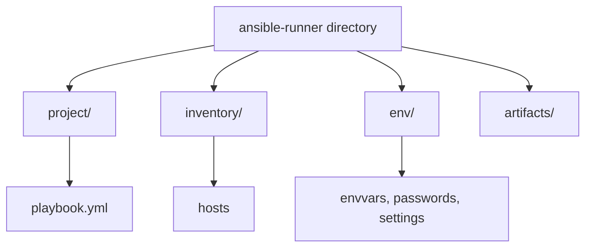

# Introduction to Ansible

Modern IT has shifted from deploying software on a single server to orchestrating distributed systems in the cloud.  

Today’s applications often rely on a mix of services—web servers, databases, caches, queues, load balancers, and monitoring tools—that must be **resilient, scalable, and maintainable**.  

Managing these systems manually (spinning up servers, editing configs, installing packages) is **time-consuming, error-prone, and unsustainable** at scale. This is where automation becomes essential.

**Ansible** provides a powerful, flexible, and approachable solution for configuration management and automation. It enables developers and system administrators to define infrastructure and application workflows in a clear, repeatable way—eliminating countless manual steps.

---

## Prerequisites

Ansible is approachable, but it assumes you’re comfortable with basic Unix/Linux system administration. Before diving in, you should know how to:

- Connect to remote machines with **SSH**  
- Use the **Bash shell** (including pipes and redirection)  
- Install and manage software packages  
- Run administrative tasks with **sudo**  
- Check and set file permissions  
- Start and stop services  
- Configure environment variables  
- Write simple scripts (in any language)  

No programming expertise is required—Ansible is designed to be useful even if you’ve never written Python or another language.

---

## Why Ansible?

- **Automation without complexity**: Replace repetitive manual steps with clear, reusable definitions.  
- **Error reduction**: Minimize mistakes by codifying processes.  
- **Scalability**: Manage anything from a handful of servers to complex cloud deployments.  
- **Flexibility**: Integrates with existing systems, services, and third-party tools.  

Whether you’re a developer deploying applications or a sysadmin maintaining infrastructure, Ansible helps you work **faster, more reliably, and with less frustration**.  

# Why this project uses ansible-runner

In this course, you’ll notice that some examples use ansible-runner instead of running ansible-playbook directly. Here’s why:

Structured execution: ansible-runner organizes playbooks, inventories, and environment variables in a predictable directory structure.

Reproducible environments: It helps run Ansible in isolated Python virtual environments or containers, avoiding conflicts with your system Python or installed Ansible versions.

Programmatic automation: If you want to integrate Ansible runs into other tools, CI/CD pipelines, or Python scripts, ansible-runner provides a clean API for automation.

Artifact collection: Captures execution logs, return codes, and JSON output in a structured way—useful for debugging or reporting.

Important for beginners:
You do not need ansible-runner to learn Ansible. All the playbooks in this course can also be run directly with ansible-playbook. ansible-runner is included here mainly to demonstrate how Ansible can be packaged for automation or containerized environments, which is useful in advanced scenarios.

